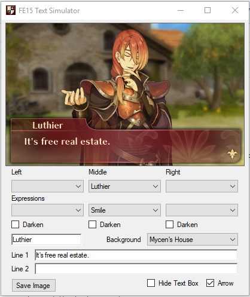

# FE15-Text-Simulator

**Some people seem to be having issues with getting the font to appear correctly. Try downloading and installing FOT-ChiaroStd-B.otf. This contains the font used in the program.**

Simulates conversation using the assets from Fire Emblem Echoes: Shadows of Valentia. Includes character portraits, text boxes, and font. It is not 100% accurate to how it would appear in the game, but I tried to make it close to how it would be.

# Changelog (V1.1)
- Picture box now updates automatically, reload button has been removed
- Added DLC Portraits (Emma, Randal, Shade, Yuzu, Clive, Mathilda, Hostages, Tomb Lord)
- Added built-in background images
- Renamed some expressions to match FEH's namings
- Added option to hide text box

# Requirements
- FOT-ChiaroStd-B font installed (otherwise text font will not display correctly)
- .NET Framework 4.5 or higher
